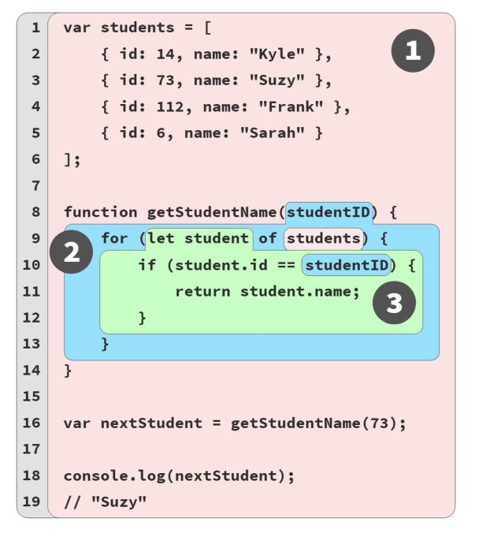

# using the same example



## Scope chain definition

The connections between scopes that are nested within other scopes is called the scope chain

Note: Js Engine doesnt need to lookup in all the scopes, where a variable comes from. that information is already known.

when a variable is nod declared , its not necessary an error, because can be declared in another file that share global scope

### Shadowing ("cuando las variables se hacen sombra")

Shadowing makes references when variables has the same name in different scopes. every variable takes the value of the "nearest scope"

```
var studentName = "Suzy";
function printStudent(studentName) {
    studentName = studentName.toUpperCase();
    console.log(studentName);
}
printStudent("Frank");
// FRANK
printStudent(studentName);
// SUZY
console.log(studentName);
// Suzy
```

## Function name scope

Function declaration looks like this:
```
function askQuestion() {
        // ..
}
```

Funcion expression looks like this:
```
var askQuestion = function(){  //anonymous function expression
    // ..
};

var askQuestion = function ofTheTeacher() { // named function expression
console.log(ofTheTeacher);
};

```

ES6 added an additional function expression form to the
language, called “arrow functions”:

```
var askQuestion = () => {
    // ..
};
```

arrow functions have the same lexical scope rules as
function functions do.

