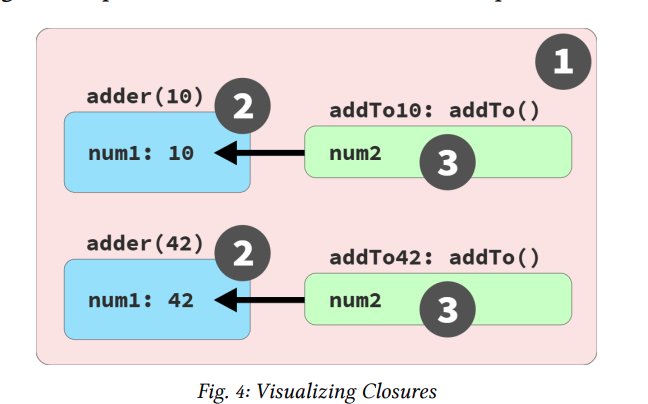

# Closure

Closure builds on this approach: for variables we need to use
over time, instead of placing them in larger outer scopes, we
can encapsulate (more narrowly scope) them but still preserve
access from inside functions, for broader use. Functions remember these referenced scoped variables via closure.

If you’ve ever written a callback that accesses variables outside its own scope… guess what!? That’s closure.

Closure is a behavior of functions and only functions.

example:
```
function lookupStudent(studentID) {
    // function scope: BLUE(2)
    var students = [
        { id: 14, name: "Kyle" },
        { id: 73, name: "Suzy" },
        { id: 112, name: "Frank" },
        { id: 6, name: "Sarah" }
    ];
    return function greetStudent(greeting) {
        // function scope: GREEN(3)
        var student = students.find(
            student => student.id == studentID
        );
        return `${greeting}, ${student.name}!`;
    };
}
var chosenStudents = [
    lookupStudent(6),
    lookupStudent(112)
];
// accessing the function's name:
console.log(chosenStudents[0].name)  
// greetStudent
console.log(chosenStudents[0]("Hello"));
// Hello, Sarah!
console.log(chosenStudents[1]("Howdy"));
// Howdy, Frank!
```
greetStudent function is closure because in his scope doenst exist greeting variable

another example easier to understand can be this

```
function adder(num1) {
    return function addTo(num2) {
        console.log(num1 + num2);
        return num1 + num2;
    };
}
var add10To = adder(10);
var add42To = adder(42);
add10To(15); // 25 // HE REMEMBER THE NUM1 VALUE (10)
add42To(9); // 51 // HE REMEMBER THE NUM1 VALUE (42)

```

this image can clear any confusion




another example of closure using ajax

```
function lookupStudentRecord(studentID) {
    ajax(
        `https://some.api/student/${studentID}`,
        function onRecord(record) {
            console.log(
                `${record.name} (${studentID})`
            );
        }
    );
}
lookupStudentRecord(114);
    // Frank (114)
```

Why then is studentID still around and accessible to the
callback? Closure.

Closure is per variable rather than per scope.

conclusions

- Observational: closure is a function instance remembering its outer variables even as that function is passed to
and invoked in other scopes.
- Implementational: closure is a function instance and its
scope environment preserved in-place while any references to it are passed around and invoked from other
scopes